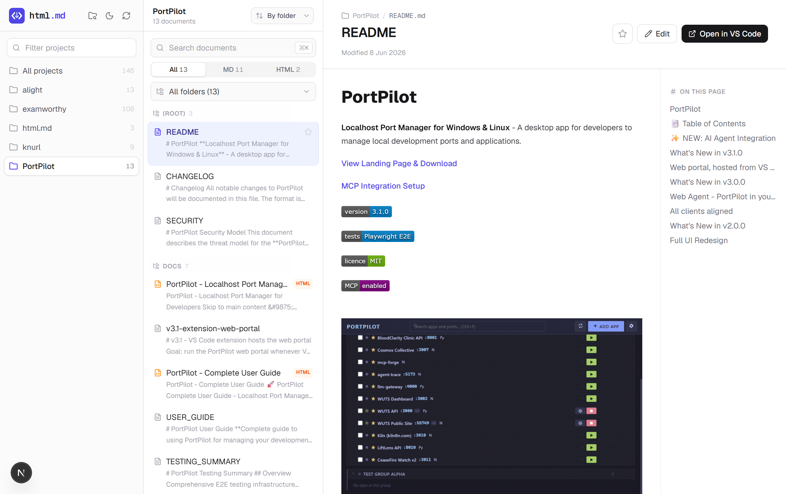
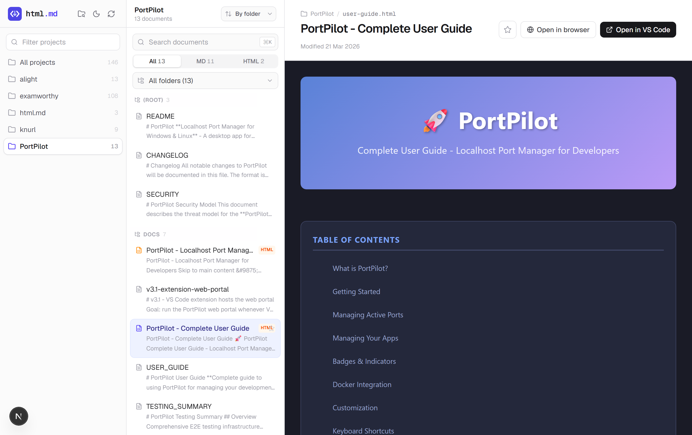
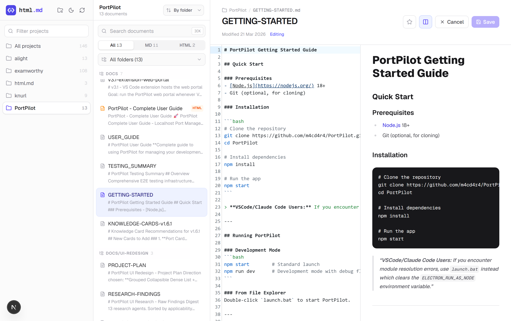
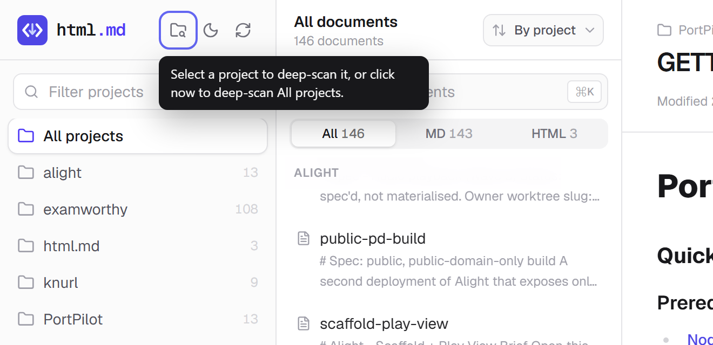

<p align="center">
  <picture>
    <source media="(prefers-color-scheme: dark)" srcset="public/logo-dark.svg" />
    
  </picture>
</p>

<p align="center">
  One dashboard for every markdown and HTML doc across all your projects.
</p>

<p align="center">
  <em>Local-first. No accounts, no telemetry, no cloud. Your docs never leave your machine.</em>
</p>

---

<p align="center">
  <picture>
    <source media="(prefers-color-scheme: dark)" srcset="docs/screenshots/hero-dark.png" />
    
  </picture>
</p>

If you work across a lot of repos, your documentation gets scattered: a `README` here, a `PROJECT-PLAN.md` three folders deep there, an HTML report you generated last month and will never find again. **html.md** scans all of it and gives you one fast, searchable place to read it.

The catch with off-the-shelf tools (Foam, Obsidian, Dendron) is they index every file in a folder, so a project with a dozen git worktrees shows up a dozen times. html.md understands git worktrees and collapses them, so **each project appears exactly once.**

## Why html.md

- **Git-worktree aware.** It classifies every folder by its `.git` (main repo, worktree, or orphaned worktree leftover) and folds worktrees into their canonical project. One repo, one entry, no duplicates.
- **Markdown and HTML.** Renders markdown beautifully and serves HTML docs (reports, exports, dashboards) live in a sandboxed frame, with relative assets working.
- **Built for scale.** Designed for hundreds of projects and thousands of docs. Subfolder grouping, type filters, and a command palette keep it fast.
- **Local and private.** Reads files from disk only. Nothing is uploaded, nothing is tracked.

## Features

- **Three-pane browser** - projects, documents, and a reader with an "on this page" table of contents
- **Worktree deduplication** - each project appears once, with curated aliases for edge cases
- **Subfolder navigation** - group and filter a large project's docs by folder (`docs/prompts`, `docs/architecture`, ...)
- **Type filter** - All / MD / HTML, with live counts
- **Sort** - by folder, newest, oldest, or name A-Z
- **Command palette** - press `Cmd/Ctrl + K` to fuzzy-jump to any doc across every project
- **Bookmarks** - star documents and pin projects (saved locally)
- **Edit in place** - open any markdown doc in a syntax-highlighted CodeMirror editor with a live split preview, and save straight to disk
- **Deep scan** - select one project and scan every subfolder for docs buried in `tests/`, `src/`, etc., or scan everything at once
- **Reading niceties** - rendered markdown, copy buttons on code blocks, relative images served from disk
- **Dark mode** - with a no-flash theme toggle
- **Open in VS Code** - jump straight to any file in your editor

## Screenshots

**Render HTML docs live.** HTML reports, exports, and dashboards are served in a sandboxed frame with their own styles and relative assets intact.

<p align="center">
  
</p>

**Edit with a live preview.** Open any markdown doc in a CodeMirror editor and watch the rendered output update beside it.

<p align="center">
  
</p>

**Deep-scan a single project.** Select a project to deep-scan just that one (fast and surgical), or scan everything when nothing is selected.

<p align="center">
  
</p>

## Quick start

Requirements: Node 20+, and the `code` CLI on your PATH for "Open in VS Code".

```bash
git clone https://github.com/m4cd4r4/docs-dashboard.git
cd docs-dashboard
npm install
npm run dev
```

Open **http://localhost:3939**. The port is pinned so it will not fight other dev servers running on 3000.

## Configuration

Copy `config.example.json` to `config.json` and set your own roots:

```json
{
  "indexDirs": ["C:/dev", "C:/work", "~/notes"],
  "cacheMinutes": 5,
  "includeWorktrees": false,
  "aliases": {
    "myapp": "my-application-monorepo"
  }
}
```

| Field | What it does |
| --- | --- |
| `indexDirs` | Root folders to scan. Each direct subfolder is treated as a project. |
| `cacheMinutes` | How long the index is cached before a background re-scan. |
| `includeWorktrees` | `false` (default) collapses git worktrees into their main repo. Set `true` to list every worktree separately. |
| `deepScan` | `false` (default) scans only the curated doc folders. `true` scans every subfolder. There is also a deep-scan toggle in the app's top-left: with a project selected it deep-scans just that project (fast, surgical); with none selected it deep-scans everything. |
| `aliases` | Maps an orphaned-worktree folder prefix to its real project name, for leftover worktree directories that no longer have a `.git`. |

## How the deduplication works

For every top-level folder, html.md inspects `.git`:

- a **directory** means a real repo or clone, so it is its own project;
- a **file** means a git worktree, and the file points at the main repo, so its docs are already covered there and the worktree is skipped;
- **no `.git`** means a possible orphaned worktree directory, which is folded into its canonical project via a learned or configured alias.

A safety net guarantees a worktree's main repo is always scanned, even if it lives outside your configured roots, so collapsing worktrees never loses a document.

## What gets indexed

- Markdown (`.md`) at a project root and inside `docs/`, `doc/`, `.claude/`, and `.github/` (two levels deep)
- HTML (`.htm`, `.html`) inside those same doc folders (root-level HTML is skipped, since it is usually an app shell rather than a doc)
- Frontmatter `title` and `tags` when present

## Keyboard

| Shortcut | Action |
| --- | --- |
| `Cmd/Ctrl + K` | Open the command palette |
| `↑` / `↓` | Move through results |
| `↵` | Open the selected doc |
| `Esc` | Close the palette |

## Tech stack

Next.js 16 (App Router) - React 19 - Tailwind CSS v4 - Fuse.js (fuzzy search) - react-markdown + remark-gfm - lucide-react.

## Privacy

html.md runs entirely on your machine. It reads local files, serves them to a browser tab on localhost, and stores bookmarks in your browser's local storage. There is no backend service, no network calls, and no analytics.

## License

MIT.
